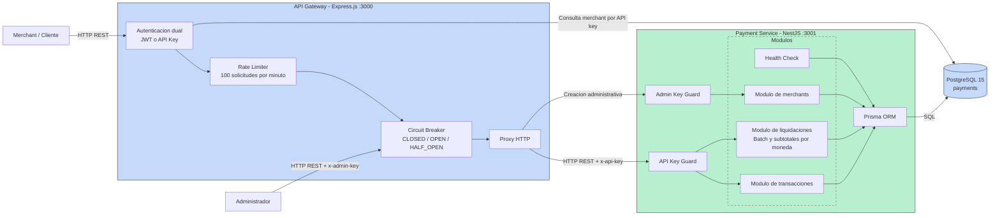
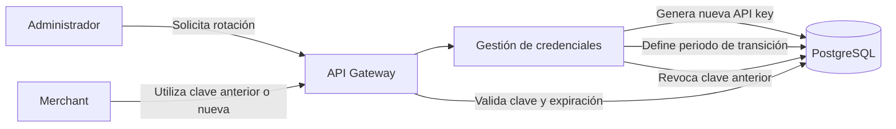

# Arquitectura Del Sistema De Pagos

## Descripción General

El sistema utiliza una arquitectura de microservicios compuesta actualmente por:

- API Gateway desarrollado con Express.js.
- Payment Service desarrollado con NestJS.
- PostgreSQL 15 como base de datos.
- Docker Compose para ejecutar y comunicar los servicios.

## Diagrama De Arquitectura



## Comunicación Entre Servicios

La comunicación entre el API Gateway y Payment Service utiliza HTTP REST
síncrono.

El Gateway valida las credenciales, aplica rate limiting y protege las llamadas
al Payment Service mediante un circuit breaker. Después reenvía la API key del
merchant autenticado para que Payment Service también valide la identidad.

### Justificación

HTTP REST fue seleccionado porque:

- Simplifica los flujos de petición y respuesta.
- Permite propagar códigos HTTP al cliente.
- Facilita las pruebas y depuración.
- No requiere infraestructura adicional como Redis o RabbitMQ.

### Trade-offs

- El Gateway depende temporalmente de la disponibilidad de Payment Service.
- Una operación lenta puede mantener conexiones abiertas.
- El rate limiter y circuit breaker viven en memoria.
- Cada réplica del Gateway tendría contadores y estados independientes.
- El Gateway consulta PostgreSQL directamente para autenticar merchants,
  creando cierto acoplamiento con la base de datos.

## Circuit Breaker

El API Gateway incorpora un circuit breaker con tres estados:

```text
CLOSED → OPEN → HALF_OPEN
   ↑                   |
   └───────────────────┘
```

- `CLOSED`: permite solicitudes normalmente.
- `OPEN`: rechaza solicitudes después de cinco fallos consecutivos.
- `HALF_OPEN`: después de treinta segundos permite una solicitud de prueba.
- Si la prueba funciona, regresa a `CLOSED`.
- Si falla, vuelve a `OPEN`.

## Liquidaciones Por Moneda

Una liquidación general se representa mediante `SettlementBatch`.

La decisión tecnica, es que al momento de la prueba, la propuesta era que para generar una liquidación debia de tener `total_amount` pero como tambien habia el tipo de moneda no se podia simplemente sumar los valores por lo que no distinguia entre tipos de moneda.

Cada batch contiene una liquidación hija por moneda:

```text
SettlementBatch
├── Settlement COP
├── Settlement GTQ
└── Settlement USD
```

Esta decisión evita sumar directamente cantidades de monedas diferentes.

Cada `Settlement` almacena su propio `total_amount`, moneda y cantidad de
transacciones. La restricción única sobre `batch_id` y `currency` garantiza un
solo subtotal por moneda dentro de cada batch.

La tabla `settlement_transactions` mantiene `transaction_id` como único,
evitando liquidar una transacción más de una vez.

## Health Checks

Payment Service expone `GET /health` y realiza una consulta real a PostgreSQL.

Si la conexión funciona responde `200`; si falla responde
`503 Service Unavailable`.

## Escalabilidad A 10.000 TPS

Para soportar aproximadamente 10.000 transacciones por segundo propondría:

1. Ejecutar múltiples réplicas stateless del Gateway y Payment Service detrás
   de balanceadores de carga (distribución de la cantidad de peticiones entre distintas instancias).
2. Reemplazar el rate limiter en memoria por Redis para compartir límites entre
   réplicas.
3. Incorporar PgBouncer para administrar eficientemente las conexiones.
4. Particionar `transactions` por fecha o merchant según los patrones reales.
5. Utilizar réplicas de lectura para consultas y reportes.
6. Incorporar claves de idempotencia para soportar reintentos sin duplicados.
7. Separar las bases de datos por microservicio y evitar acceso directo desde el
   Gateway.

## Evolución Propuesta: Rotación Segura De API Keys

Actualmente cada merchant posee una única API key utilizada para autenticar sus
solicitudes. Como evolución futura se propone permitir la rotación segura de
credenciales sin interrumpir el procesamiento de pagos.



En lugar de guardar la API key directamente en la tabla `merchants`, se
utilizaría una tabla independiente:

```text
merchant_api_keys
├── id
├── merchant_id
├── key_hash
├── status
├── created_at
├── expires_at
└── revoked_at
```

Las API keys se almacenarían mediante hash. El valor original solamente se
mostraría una vez al momento de su creación.

Durante la rotación existiría un periodo controlado en el cual la clave anterior
y la nueva serían válidas. Al terminar ese periodo, la clave anterior se
revocaría automáticamente.

### Beneficios

- Permite renovar credenciales sin detener integraciones activas.
- Reduce el impacto de una API key comprometida.
- Evita almacenar credenciales en texto plano.
- Permite mantener historial y auditoría de claves.
- Facilita revocar una clave específica sin desactivar al merchant.

### Trade-offs

- La autenticación requiere buscar y comparar hashes.
- Se necesita administrar expiración y revocación.
- Durante el periodo de transición pueden existir varias claves válidas.
- Requiere procesos automáticos para revocar claves vencidas.

## Evolución Propuesta: Mejoramiento de liquidaciones

Actualmente las liquidaciones separan las transacciones por moneda para evitar
sumar importes que no son financieramente comparables.

Como evolución futura, cada merchant podría configurar una moneda base, por
ejemplo USD, COP, EUR o GTQ. El sistema mantendría los subtotales originales por
moneda y calcularía adicionalmente un total consolidado convertido a la moneda
base seleccionada.

### Funcionalidades Propuestas

- Configuración de una moneda base independiente para cada merchant.
- Conversión de los subtotales mediante tasas de cambio históricas.
- Conservación del importe y moneda original de cada transacción.
- Registro de la tasa utilizada, su fuente y fecha de vigencia.
- Generación de un total consolidado en la moneda base del merchant.
- Consulta del detalle de conversiones dentro de cada liquidación.
- Reprocesamiento controlado cuando una tasa de cambio sea corregida.
- Exportación de reportes de liquidación por período y moneda.
- Estados adicionales para identificar liquidaciones pendientes de tasa.
- Reglas de redondeo configurables según la moneda.

### Modelo Propuesto

Cada conversión debería registrar información suficiente para ser reproducible
y auditable:

```text
settlement_exchange_rates
├── id
├── settlement_batch_id
├── source_currency
├── target_currency
├── exchange_rate
├── provider
├── effective_at
└── created_at

```
